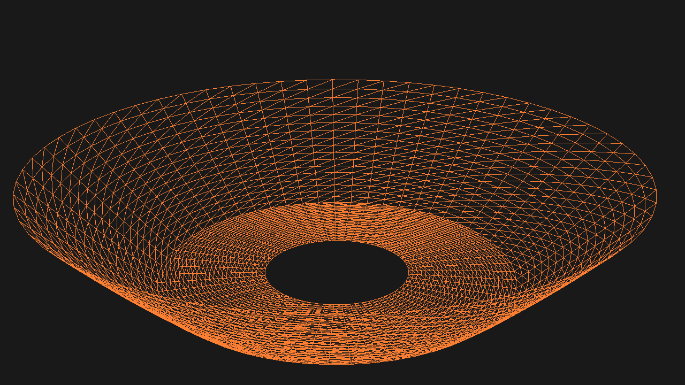

# Bowl mesh generator OpenGL
Project contain code generate disk, elliptic paraboloid and bowl mesh***

***Creating a bowl mesh consists of three steps:***

### 1. Generate disk mesh

### 2. Generate elliptic paraboloid mesh

### 3. And combining these two mesh

 

## Another examples:

### Example №1 - Part Bowl

### Example №2 - Bowl with hole 

## Third party library:
- [GLM](https://github.com/g-truc/glm)
- [meshgrid and linspace](https://github.com/xiaohongchen1991/meshgen)
- [stb_image/stb_image_write](https://github.com/nothings/stb)